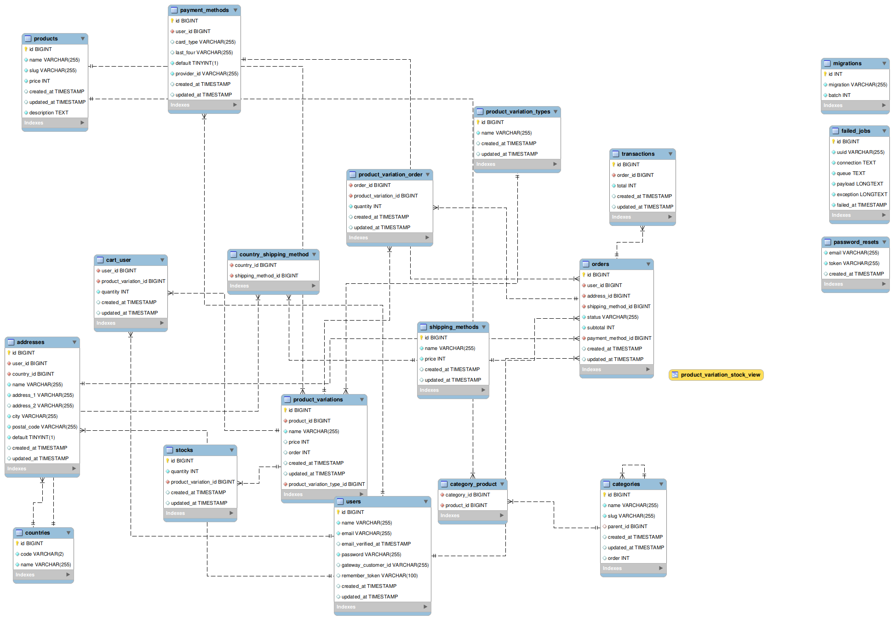

# Modern shopping-cart API using Laravel

An API using the [Laravel](http://laravel.com/) framework using most of the modern features and built in [TDD](https://en.wikipedia.org/wiki/Test-driven_development).

The repository does not contain a client-side for now, but you can find the corresponding client using Vue.js [here]() and soon there will be a client using React.js

## Database structure

## Installation

First install the repo to your local machine

`git clone https://github.com/ahmedosama-st/modern-shopping-cart.git` or [download as zip](https://github.com/ahmedosama-st/modern-shopping-cart/archive/refs/heads/master.zip)

`cd modern-shopping-cart`

`composer install`

`php artisan migrate`

`php artisan db:seed` Seeding the countries table with data

Now you can start using the project as a template for your further projects

---

_Note:_ There might be a course related to this project where we walk through every feature and how to design it using the TDD methodology, if you're interested let me know [here](https://m.me/SecTheaterEG) ^-^
